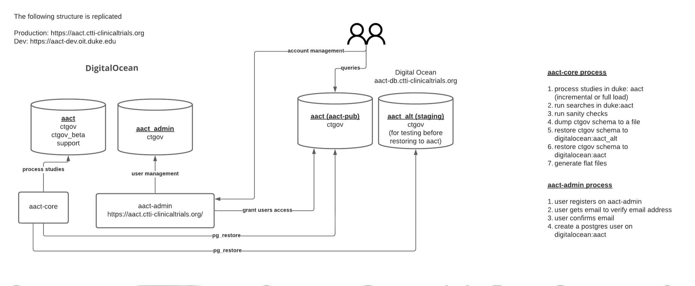

# AACT
Database for Aggregated Analysis of ClinicalTrials.gov

## Purpose

This is a ruby on rails application that retreives the content of <a href="clinicaltrials.gov" target="_blank">clinicaltrials.gov</a> (via their API) and makes the information available in a relational database.  We do this to make this valuable body of information accessible to the public as a complete aggregated set of data.

If you need a copy of the database, but don't want to bother installing & running this app, copies of the database are available for download from the <a href='https://aact.ctti-clinicaltrials.org/snapshots' target='_blank'>AACT website (Download page).</a> We use pg_dump to create a snapshot of the database after each nightly update, so a version is always available with the most current info from clinicaltrials.gov.

## Getting Started

These instructions assume you're on a Mac. Linux users will need to use yum or apt-get to install tools. (Apologies to Windows users.)

* If you don't already have standard development tools on your machine, this might help get you mostly setup: https://github.com/thoughtbot/laptop

Below you'll find an image that illustrates the different AACT databases and schemas, while briefly describes their purposes.


## You'll need:

### git
*  <a href='https://git-scm.com/book/en/v2/Getting-Started-Installing-Git' target='_blank'>git</a> to clone the AACT application.
*  We recommend a ruby version manager. Popular ones are: <a href='http://rvm.io/' target='_blank'>rvm</a> & <a href='https://github.com/rbenv/rbenv' target='_blank'>rbenv</a>. We use <a href='https://github.com/postmodern/chruby' target='_blank'>chruby</a> because it is lightweight.
*  **ruby 2.6.2**  If using chruby, you can get this version with the command: `ruby-install 2.6.2`
*  **postgres 11.1** `brew install postgresql`  You could use other versions of postgres or a different relational database such as mysql, but if so, you might need to make changes to files in db/migrate & will probably need to make a few changes to *app/models/util/db_manager.db* since it drops/creates indexes thinking it's dealing with postgres 11.1.
*  Create a postgres superuser account/password for the AACT database.  Grant this user permission to create a database. You will also need to create environment variables that define the username password for this account. (See required variables below.)
*  ** create user *<your_pg_superuser_name>* with password '*<a-secure-password>*';
*  ** alter user *<your_pg_superuser_password>* createdb;
*  **wget** if you don't already have it: `brew install wget`

###  ruby
*  We recommend you use a ruby version manager. Popular ones are: <a href='http://rvm.io/' target='_blank'>rvm</a> & <a href='https://github.com/rbenv/rbenv' target='_blank'>rbenv</a>. We use <a href='https://github.com/postmodern/chruby' target='_blank'>chruby</a> because it is lightweight. (`brew install chruby`)
*  **ruby 2.6.2**  If using chruby, you can get it with the command: `ruby-install ruby 2.6.2`

### Environment variables

Add the following to your shell profile (for example .bash_profile):

```bash
## aact Rails.env != 'test'
#export AACT_DB_SUPER_USERNAME='chuck_aact'
#export AACT_ADMIN_EMAILS="charlesvincentanderson@gmail.com"
#export AACT_STATIC_FILE_DIR='~/aact/public/static'
#export RACK_TIMEOUT=10
#export APPLICATION_HOST='localhost'
#export AACT_PUBLIC_HOSTNAME='localhost'
#export AACT_BACK_DATABASE_NAME='aact'
#export AACT_ADMIN_DATABASE_NAME='aact_admin'
#export AACT_PUBLIC_DATABASE_NAME='aact'
#export AACT_ALT_PUBLIC_DATABASE_NAME='aact_alt'
#export AACT_BACK_DATABASE_URL="postgres://$AACT_DB_SUPER_USERNAME@$APPLICATION_HOST:5432/$AACT_BACK_DATABASE_NAME"
#export AACT_ADMIN_DATABASE_URL="postgres://$AACT_DB_SUPER_USERNAME@$APPLICATION_HOST:5432/$AACT_ADMIN_DATABASE_NAME"
#export AACT_PUBLIC_DATABASE_URL="postgres://$AACT_DB_SUPER_USERNAME@$AACT_PUBLIC_HOSTNAME:5432/$AACT_PUBLIC_DATABASE_NAME"
#export AACT_ALT_PUBLIC_DATABASE_URL="postgres://$AACT_DB_SUPER_USERNAME@$AACT_PUBLIC_HOSTNAME:5432/$AACT_ALT_PUBLIC_DATABASE_NAME"


## aact Rails.env = 'test'
#export AACT_DB_SUPER_USERNAME='chuck_aact'
#export AACT_ADMIN_EMAILS="charlesvincentanderson@gmail.com"
#export AACT_STATIC_FILE_DIR='~/aact/public/static'
#export RACK_TIMEOUT=10
#export APPLICATION_HOST='localhost'
#export AACT_PUBLIC_HOSTNAME='localhost'
#export AACT_BACK_DATABASE_NAME='aact_test'
#export AACT_ADMIN_DATABASE_NAME='aact_admin_test'
#export AACT_PUBLIC_DATABASE_NAME='aact_pub_test'
#export AACT_ALT_PUBLIC_DATABASE_NAME='aact_alt_test'
#export AACT_BACK_DATABASE_URL="postgres://$AACT_DB_SUPER_USERNAME@$APPLICATION_HOST:5432/$AACT_BACK_DATABASE_NAME"
#export AACT_ADMIN_DATABASE_URL="postgres://$AACT_DB_SUPER_USERNAME@$APPLICATION_HOST:5432/$AACT_ADMIN_DATABASE_NAME"
#export AACT_PUBLIC_DATABASE_URL="postgres://$AACT_DB_SUPER_USERNAME@$AACT_PUBLIC_HOSTNAME:5432/$AACT_PUBLIC_DATABASE_NAME"
#export AACT_ALT_PUBLIC_DATABASE_URL="postgres://$AACT_DB_SUPER_USERNAME@$AACT_PUBLIC_HOSTNAME:5432/$AACT_ALT_PUBLIC_DATABASE_NAME"


## aact_admin Rails.env != 'test'
#export AACT_DB_SUPER_USERNAME='chuck_aact'
#export AACT_STATIC_FILE_DIR='~/aact/public/static'
#export AACT_ADMIN_USERNAMES='chuck'
#export RACK_TIMEOUT=10
#export APPLICATION_HOST='localhost'
#export AACT_PUBLIC_HOSTNAME='localhost'
#export AACT_BACK_DATABASE_NAME='aact_back'
#export AACT_ADMIN_DATABASE_NAME='aact_admin'
#export AACT_PUBLIC_DATABASE_NAME='aact'
#export AACT_BACK_DATABASE_URL="postgres://$AACT_DB_SUPER_USERNAME@$APPLICATION_HOST:5432/$AACT_BACK_DATABASE_NAME"
#export AACT_ADMIN_DATABASE_URL="postgres://$AACT_DB_SUPER_USERNAME@$APPLICATION_HOST:5432/$AACT_ADMIN_DATABASE_NAME"
#export AACT_PUBLIC_DATABASE_URL="postgres://$AACT_DB_SUPER_USERNAME@$AACT_PUBLIC_HOSTNAME:5432/$AACT_PUBLIC_DATABASE_NAME"


## aact_admin Rails.env = 'test'
#export AACT_DB_SUPER_USERNAME='chuck_aact'
#export RAILS_SERVE_STATIC_FILES=false
#export AACT_STATIC_FILE_DIR=~/aact/public/static/
#export AACT_ADMIN_USERNAMES='chuck'
#export RACK_TIMEOUT=10
#export APPLICATION_HOST='localhost'
#export AACT_PUBLIC_HOSTNAME='localhost'
#export AACT_BACK_DATABASE_NAME='aact_back_test'
#export AACT_ADMIN_DATABASE_NAME='aact_admin_test'
#export AACT_PUBLIC_DATABASE_NAME='aact_test'
#export AACT_BACK_DATABASE_URL="postgres://$AACT_DB_SUPER_USERNAME@$APPLICATION_HOST:5432/$AACT_BACK_DATABASE_NAME"
#export AACT_ADMIN_DATABASE_URL="postgres://$AACT_DB_SUPER_USERNAME$@$APPLICATION_HOST:5432/$AACT_ADMIN_DATABASE_NAME"
#export AACT_PUBLIC_DATABASE_URL="postgres://$AACT_DB_SUPER_USERNAME@$AACT_PUBLIC_HOSTNAME:5432/$AACT_PUBLIC_DATABASE_NAME"


##aact-proj Rails.env = 'test'
#export AACT_DB_SUPER_USERNAME='chuck_aact'
#export AACT_PROJ_DB_SUPER_USERNAME="chuck_aact"
#export AACT_STATIC_FILE_DIR='~/aact/public/static/'
#export APPLICATION_HOST='localhost'
#export AACT_PUBLIC_HOSTNAME='localhost'
#export AACT_BACK_DATABASE_NAME='aact_back_test'
#export AACT_PUBLIC_DATABASE_NAME='aact_test'
#export AACT_PROJ_DATABASE_NAME='aact_proj_test'
#export AACT_ALT_PUBLIC_DATABASE_NAME='aact_alt_test'
#export AACT_ADMIN_DATABASE_NAME='aact_admin_test'
#export AACT_PROJ_DATABASE_URL="postgres://$AACT_DB_SUPER_USERNAME@$AACT_PUBLIC_HOSTNAME:5432/$AACT_PROJ_DATABASE_NAME"
#export AACT_PUBLIC_DATABASE_URL="postgres://$AACT_DB_SUPER_USERNAME@$AACT_PUBLIC_HOSTNAME:5432/$AACT_PUBLIC_DATABASE_NAME"
#export AACT_ALT_PUBLIC_DATABASE_URL="postgres://$AACT_DB_SUPER_USERNAME@$AACT_PUBLIC_HOSTNAME:5432/$AACT_ALT_PUBLIC_DATABASE_NAME"
#export AACT_ADMIN_DATABASE_URL="postgres://$AACT_DB_SUPER_USERNAME@$APPLICATION_HOST:5432/$AACT_ADMIN_DATABASE_NAME"


##aact-proj Rails.env != 'test'
#export AACT_DB_SUPER_USERNAME='chuck_aact'
#export AACT_PROJ_DB_SUPER_USERNAME="chuck_aact"
#export AACT_STATIC_FILE_DIR='~/aact/public/static/'
#export APPLICATION_HOST='localhost'
#export AACT_PUBLIC_HOSTNAME='localhost'
#export AACT_BACK_DATABASE_NAME='aact_back'
#export AACT_PUBLIC_DATABASE_NAME='aact'
#export AACT_ALT_PUBLIC_DATABASE_NAME='aact_alt'
#export AACT_PROJ_DATABASE_NAME='aact_proj'
#export AACT_ADMIN_DATABASE_NAME='aact_admin'
#export AACT_PROJ_DATABASE_URL="postgres://$AACT_DB_SUPER_USERNAME@$AACT_PUBLIC_HOSTNAME:5432/$AACT_PROJ_DATABASE_NAME"
#export AACT_PUBLIC_DATABASE_URL="postgres://$AACT_DB_SUPER_USERNAME@$AACT_PUBLIC_HOSTNAME:5432/$AACT_PUBLIC_DATABASE_NAME" #aact-db.ctti-clinicaltrials.org
#export AACT_ALT_PUBLIC_DATABASE_URL="postgres://$AACT_DB_SUPER_USERNAME@$AACT_PUBLIC_HOSTNAME:5432/$AACT_ALT_PUBLIC_DATABASE_NAME"
#export AACT_ADMIN_DATABASE_URL="postgres://$AACT_DB_SUPER_USERNAME@$APPLICATION_HOST:5432/$AACT_ADMIN_DATABASE_NAME"

```

If you intend to populate a 'public' database on a different server from the one that performs the loads:
* export AACT_PUBLIC_HOSTNAME=*domain name of server*   (Set this to the domain name of the server that will host the database available to users.)

If you intend to send email notifications to yourself or others whenever a database load completes, you will need to set these variables:
* export AACT_OWNER_EMAIL=*<aact-sys@email.addr>*
* export AACT_ADMIN_EMAILS=*<your@email.addr>,<another-admin@email.addr>*

Create .pgpass file in the root directory of your database server that includes the line:  localhost:5432:*:<your_pg_superuser_name>:<your_superuser_password>*

In the command line:
*  `chmod 0600 .pgpass`  (set restrictive permissions on this file)

You may need to open your pg_hba.conf file (often this is located at ~/../../etc/postgresql/11/main/pg_hba.conf) and change all md5 values to trust if your pgpass file is not working

### postgreSQL (supported: version 11.1)
If you don't already have postgreSQL, you'll need to know a bit about setting up & administering it, particularly with respect to security. At the time of this writing, a good site for postgreSQL instructions for the Mac: https://gist.github.com/ibraheem4/ce5ccd3e4d7a65589ce84f2a3b7c23a3.  

In short, if you're installing on a Mac, basic steps to get started can be:

*  `brew install postgresql`
*  `ln -sfv /usr/local/opt/postgresql/*.plist ~/Library/LaunchAgents`
*  Add these lines to your shell profile (such as .bash_profile):
   *   `alias pg_start="launchctl load ~/Library/LaunchAgents/homebrew.mxcl.postgresql.plist"`
   *   `alias pg_stop="launchctl unload ~/Library/LaunchAgents/homebrew.mxcl.postgresql.plist"`
*  `mkdir /usr/local/var/pg_data`
*  `initdb /usr/local/var/pg_data -E utf8`
*  `pg_ctl -D /usr/local/var/pg_data -l logfile start`
*  `createuser -s postgres`
*  `psql -d template1`
*  template1=# `create role <your_aact_pg_user> login password '<your_pg_password>';`
*  template1=# `alter user <your_aact_pg_user> with superuser;`
*  template1=# `create role read_only;`
*  template1=# `create database aact;`
*  template1=# `create database aact_alt;`
*  template1=# `\q`  (quit out of psql)
*  Verify your new user can login to postgres with command: `psql -U <your_aact_pg_user> -d template1`
*  template1=# \q (quit psql))
*  Clone this repo: `git clone git@github.com:ctti-clinicaltrials/aact.git`
*  Change into the AACT directory: `cd aact` and run the following commands:

Note:  You could use other versions of postgres or a different relational database such as mysql. If so, you'll need to make changes to files in db/migrate & *app/models/util/db_manager.db* since it drops/creates indexes under assumption it's using postgres 11.1.

### Create directory for static files

AACT downloads the complete set of studies from ClinicalTrials.gov as a zipfile that contains an xml file for each study [[https://clinicaltrials.gov/search/resultsxml=true]].  Until recently, the ClinicalTrials.gov API only provided this info in XML format.  In June, 2019, an improved API was deployed in beta which provides a far more flexible way to retrieve studies from ClinicalTrials.gov and also lets you retrieve it as json.  [[https://clinicaltrials.gov/ct2/about-site/new]]

By default, AACT saves the downloaded xml file in a directory under /aact-files. (Note, this is in the server root directory, not the root of the AACT application.)  To override this, use the AACT_STATIC_FILE_DIR environment variable to define a different directory.  Otherwise, you will need to create /aact-files at the server root directory and change permissions on it so that the rails application owner has permission to read/write to that directory.

*  `sudo su`               # you need superuser rights to create the directory
*  `mkdir /aact-files`
*  `chown <your-system-account> /aact-files`
*  `chgrp <your-system-account> /aact-files`
*  `exit`                 # exit the superuser login


## Install AACT

*  Clone this repo: `git clone git@github.com:ctti-clinicaltrials/aact.git`
*  Change into the AACT directory you just created: `cd aact`
*  `gem install bundler -v 1.9.0`
*  `bundle install`

Go into your .bash_profile and uncomment only the section for aact Rails.env != test

Open a new terminal

*  `bundle exec rake db:create`   (create the database)
*  `bundle exec rake db:migrate`  (create tables, indexes, views, etc. in the database)
*  `bundle exec rake db:seed`     (Populate with sample data to verify it all works.)

Go into your .bash_profile and uncomment only the section for aact Rails.env = test

Open a new terminal

*  `bundle exec rake db:create RAILS_ENV=test`   (create the database)
*  `bundle exec rake db:migrate RAILS_ENV=test`  (create tables, indexes, views, etc. in the database)

Log back into psql and grant permissions:

* `psql -U <your_aact_pg_user> -d aact`
* `GRANT USAGE ON SCHEMA ctgov TO read_only;`
* `GRANT SELECT ON ctgov.studies TO read_only;`
* `\c aact_test`
* `GRANT USAGE ON SCHEMA ctgov TO read_only;`
* `GRANT SELECT ON ctgov.studies TO read_only;`
* `\q`

Back in the command line:

* `service postgresql stop`
* `service postgresql start`

Now run the test suite to make sure you're all set

* `bundle exec rspec`

## Import studies from clinicaltrials.gov

### Full import

`bash -l -c 'bundle exec rake full:load:run'`

The full import will download the entire dataset from clinicaltrials.gov; this takes about 20 minutes. When complete, it populates the study_xml_records table from the resulting file. Once that table's loaded with one row per study, it iterates thru each row in the table to parse the xml and saves study info to the appropriate tables.

### Daily import

`bash -l -c 'bundle exec rake incremental:load:run[days_back]'`

The daily import checks the ClinicalTrials.gov RSS feed for studies that have been added or changed. You can specify how many days back to look in the dataset with the `days_back` argument above. To import changed/new studies from two days back: `bash -l -c 'bundle exec rake incremental:load:run[2]'`

###  If you just want to load an existing copy of the database...

Download and unzip the file from the AACT website: https://aact.ctti-clinicaltrials.org/snapshots

If this is the first time & the aact database doesn't yet exist, use this command:

`pg_restore -c -C  -j 5 -v -U aact -d postgres --no-acl postgres_data.dmp &> pg_restore.log`

If you want to refresh the aact database you already have on your local machine:

`pg_restore -c -j 5 -v -U aact -d aact --no-acl postgres_data.dmp &> pg_restore.log`

## Guidelines

Use the following guides for getting things done, programming well, and
programming in style.

* [Protocol](http://github.com/thoughtbot/guides/blob/master/protocol)
* [Best Practices](http://github.com/thoughtbot/guides/blob/master/best-practices)
* [Style](http://github.com/thoughtbot/guides/blob/master/style)
